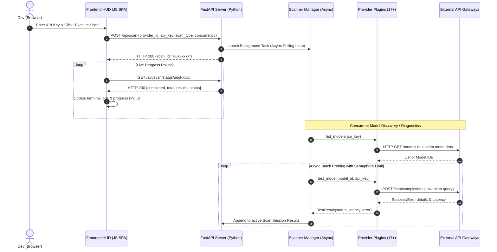

# Deep-Dive Project Documentation: Universal API Tester v2.0

This document provides a highly detailed, comprehensive technical and architectural specification for the **Universal API Tester v2.0**. It is intended for software engineers, developers, and DevOps specialists who wish to understand the inner workings, codebase, protocols, algorithms, and deployment guidelines of the platform.

---

## 1. Architectural Design & System Flow

The Universal API Tester utilizes a **decoupled, modular architecture** composed of a highly concurrent Python backend (built on FastAPI) and a responsive single-page web interface (built on HTML5, Vanilla CSS, and modern asynchronous Javascript).

### Technical Flow Diagram


---

## 2. Directory Structure & Module Deep-Dive

```text
universal-ai-tester/
├── app/
│   ├── __init__.py
│   ├── main.py                 # Original CLI/TUI entrypoint utilizing curses
│   ├── core/
│   │   ├── __init__.py
│   │   ├── chat.py             # Server-Sent Events (SSE) streaming chat pipeline
│   │   ├── scanner.py          # Dynamic model discovery & scanner registry
│   │   └── tester.py           # Concurrency-safe response tester
│   ├── providers/
│   │   ├── __init__.py         # Registry of all 17+ Provider Plugins
│   │   ├── base.py             # Abstract Base Class (BaseProvider) definition
│   │   ├── common.py           # Standard OpenAI compatibility implementation
│   │   ├── anthropic.py        # Anthropic Claude custom headers/payloads
│   │   ├── google.py           # Google Gemini custom REST parameters
│   │   ├── cohere.py           # Cohere API endpoints & compatibility mapping
│   │   ├── perplexity.py       # Custom testing validator for Perplexity APIs
│   │   ├── deepinfra.py        # DeepInfra custom mappings
│   │   └── [others].py         # Specific connector scripts
│   ├── utils/
│   │   ├── __init__.py
│   │   ├── config.py           # System constants, key preloading, config loads
│   │   ├── exporter.py         # CSV, JSON, Markdown, and TXT exporter engines
│   │   ├── logger.py           # Asynchronous rotative logging system
│   │   └── model_db.py         # Model capability matrix database (Context sizes, vision, reasoning detect)
│   └── web/
│       ├── __init__.py
│       ├── server.py           # FastAPI server routing, payloads & SSE streams
│       └── templates/
│           └── index.html      # Front-end SPA containing CSS, layout, and JS logic
```

### Module Responsibilities:

1. **`app/web/server.py`**:
   - Exposes REST endpoints to list supported API providers, initiate scans, poll scans status, and stream chat completions.
   - Manages an in-memory `SCANS` dictionary where active scan sessions are registered and updated in the background.

2. **`app/core/scanner.py`**:
   - Defines the `ScanSession` class tracking total models, completion counters, active results array, and execution states (`pending`, `running`, `completed`, `failed`).
   - Coordinates the concurrency throttling loops, running multiple network test routines concurrently.

3. **`app/core/chat.py`**:
   - Houses the `stream_chat_message` generator function.
   - Connects to different AI network providers using `httpx.AsyncClient`'s streaming connection manager (`client.stream(...)`).
   - Standardizes response buffers into generic SSE formats for consumption by the browser.

4. **`app/providers/base.py`**:
   - Declares the abstract base class `BaseProvider` which requires child connectors to implement:
     - `list_models(self, api_key: str)`: Returns list of available models.
     - `test_model(self, model_id: str, api_key: str)`: Returns latencies or errors.

---

## 3. Core Algorithms & Code Implementation

### A. Dynamic Model Discovery Probing (Asynchronous Semaphore)
To ensure rapid discovery without hitting rate limits or choking sockets, the program uses an `asyncio.Semaphore`. Below is the logical pseudocode representing this algorithm:

```python
# app/core/scanner.py - Probing Loop Logic
async def run_discovery_scan(session: ScanSession, provider, api_key, concurrency, timeout):
    # 1. Fetch available models dynamically
    try:
        model_ids = await provider.list_models(api_key)
        session.total = len(model_ids)
    except Exception as e:
        session.status = "failed"
        session.error = str(e)
        return

    # 2. Setup concurrency throttle using a Semaphore
    sem = asyncio.Semaphore(concurrency)
    
    async def probe_single_model(model_id):
        async with sem:
            session.current_model = model_id
            try:
                # Dispatch query to provider plugin
                result = await provider.test_model(model_id, api_key, timeout=timeout)
                session.results.append(result)
            except Exception as e:
                session.results.append({
                    "model_id": model_id,
                    "status": "Error",
                    "latency": 0.0,
                    "error_message": str(e)
                })
            finally:
                session.completed += 1

    # 3. Gather tasks and run concurrently
    tasks = [probe_single_model(m_id) for m_id in model_ids]
    await asyncio.gather(*tasks)
    session.status = "completed"
```

### B. EventStream (SSE) Chat Streaming Pipeline
The chat interface handles tokens as they stream from external APIs. The backend parses streaming HTTP chunks from different SDK endpoints and translates them to SSE streams. Below is the streaming processor logic inside `app/core/chat.py`:

```python
# app/core/chat.py - SSE Generator Algorithm
async def stream_chat_message(provider_id, api_key, model_id, messages, max_tokens):
    # 1. Load config matching the provider
    config = PROVIDER_CHAT_CONFIG.get(provider_id)
    start_time = time.perf_counter()

    try:
        # 2. Setup client request and headers
        async with httpx.AsyncClient().stream("POST", config["url"], headers=headers, json=payload) as response:
            if response.status_code != 200:
                yield f'{{"type": "error", "text": "HTTP {response.status_code}"}}\n'
                return

            # 3. Read stream iteratively line-by-line
            async for line in response.aiter_lines():
                if line.startswith("data: "):
                    data_str = line[6:].strip()
                    if data_str == "[DONE]":
                        break
                    
                    chunk = json.loads(data_str)
                    delta = chunk["choices"][0]["delta"]
                    
                    # Separate reasoning logs (DeepSeek R1 compatible)
                    reasoning = delta.get("reasoning_content", "")
                    if reasoning:
                        yield json.dumps({"type": "reasoning", "text": reasoning}) + "\n"
                        
                    # Standard response chunks
                    content = delta.get("content", "")
                    if content:
                        yield json.dumps({"type": "content", "text": content}) + "\n"
            
            # 4. Yield metadata summary
            latency = time.perf_counter() - start_time
            yield json.dumps({"type": "meta", "latency": latency}) + "\n"
            
    except Exception as e:
        yield json.dumps({"type": "error", "text": str(e)}) + "\n"
```

### C. Client-Side Streaming Markdown Parser (Split-Based Algorithm)
To parse markdown code blocks in real-time, especially when blocks are unclosed (still streaming), the frontend uses a **chunk-splitting parser**:

```javascript
// index.html - Client Markdown Parser
function formatMainMarkdown(text) {
    if (!text) return "";
    
    // Split the text by triple backticks
    const parts = text.split("```");
    let result = "";

    for (let i = 0; i < parts.length; i++) {
        if (i % 2 === 0) {
            // Outside code block - parse inline elements and breaks
            let part = parts[i];
            part = part.replace(/`([^`\n]+)`/g, '<code class="inline-code">$1</code>');
            part = part.replace(/\*\*([^*]+)\*\*/g, '<strong>$1</strong>');
            part = part.replace(/\n/g, '<br>');
            result += part;
        } else {
            // Inside code block - extract language tag and code content
            const blockContent = parts[i];
            let lang = "code";
            let code = blockContent;

            const firstNewline = blockContent.indexOf("\n");
            if (firstNewline !== -1) {
                const possibleLang = blockContent.substring(0, firstNewline).trim();
                if (possibleLang.length < 15 && /^[a-zA-Z0-9_-]*$/.test(possibleLang)) {
                    lang = possibleLang || "code";
                    code = blockContent.substring(firstNewline + 1);
                }
            }

            const cleanCode = code.trim();
            const isUnclosed = (i === parts.length - 1);
            const displayLang = lang + (isUnclosed ? " (streaming...)" : "");

            result += `
                <div class="code-block-wrapper">
                    <div class="code-block-header">
                        <span class="code-block-lang">${displayLang}</span>
                        <button class="code-block-copy-btn" onclick="copyCodeToClipboard(this)">Copy</button>
                    </div>
                    <pre class="code-block-content"><code>${cleanCode}</code></pre>
                </div>`;
        }
    }
    return result;
}
```

---

## 4. REST API Endpoint Reference

### 1. `POST /api/scan`
Initiates a new concurrent discovery or diagnostics scan session.
- **Request Body**:
  ```json
  {
    "provider_id": "openai",
    "api_key": "sk-...",
    "scan_type": "models",
    "concurrency": 5,
    "timeout": 15
  }
  ```
- **Response**:
  ```json
  {
    "scan_id": "9a7522df-188b-49ea-95d3-88ee114dcf72",
    "provider_id": "openai",
    "status": "pending"
  }
  ```

### 2. `GET /api/scan/status/{scan_id}`
Retrieves execution state, metrics, and discovered model records for a scan session.
- **Response**:
  ```json
  {
    "scan_id": "9a7522df-188b-49ea-95d3-88ee114dcf72",
    "status": "completed",
    "completed": 12,
    "total": 12,
    "current_model": "gpt-4o",
    "results": [
      {
        "model_id": "gpt-4o",
        "status": "Working",
        "latency": 0.452,
        "context_window": 128000,
        "supports_vision": true,
        "supports_tools": true,
        "supports_reasoning": false,
        "supports_json": true
      }
    ]
  }
  ```

### 3. `POST /api/chat`
Endpoint returning standard Server-Sent Events (SSE) content for model chat playground testing.
- **Request Body**:
  ```json
  {
    "provider_id": "openai",
    "api_key": "sk-...",
    "model_id": "gpt-4o",
    "messages": [
      {"role": "user", "content": "Explain relativity"}
    ]
  }
  ```
- **Response Stream (SSE)**:
  ```text
  data: {"type": "content", "text": "Albert"}
  data: {"type": "content", "text": " Einstein"}
  data: {"type": "meta", "latency": 1.25}
  ```

---

## 5. LocalStorage Sync & Workspace Persistence

To preserve state between page refreshes and prevent data loss, the frontend continuously synchronizes configurations to `localStorage`:
- **Preserved Keys**:
  - `activeScanId`: UUID of currently running or last completed scan.
  - `api_key`: Last entered key mapped to the selected provider.
  - `concurrency`, `timeout`, `scanType`: Form operational configs.
  - `selectedProvider`: Currently selected provider ID.
- **Rehydration Workflow**:
  1. On load, browser reads `selectedProvider` and hydrates form inputs.
  2. If `activeScanId` is stored:
     - The client sends a validation request to `/api/scan/status/{scan_id}`.
     - If the scan exists and is complete, the client renders the results table.
     - If it is still running, the UI displays the scanning loading overlay and resumes polling progress bars seamlessly.

---

## 6. Server Deployment Guidelines

### A. Systemd Daemon Service
Create `/etc/systemd/system/universal-api-tester.service` to daemonize the application:
```ini
[Unit]
Description=Universal API Tester FastAPI Daemon
After=network.target

[Service]
Type=simple
User=udoy
WorkingDirectory=/home/udoy/Documents/universal-ai-tester
ExecStart=/home/udoy/Documents/universal-ai-tester/.venv/bin/gunicorn app.web.server:app -w 4 -k uvicorn.workers.UvicornWorker -b 127.0.0.1:8000
Restart=always
RestartSec=5
Environment=PYTHONUNBUFFERED=1

[Install]
WantedBy=multi-user.target
```
Reload and start daemon:
```bash
sudo systemctl daemon-reload
sudo systemctl enable universal-api-tester
sudo systemctl start universal-api-tester
```

### B. Nginx Reverse Proxy Config (with SSE Support)
Create a new configuration block in `/etc/nginx/sites-available/universal-api-tester`:
```nginx
server {
    listen 80;
    server_name api-tester.local;

    # Dynamic payload upload configurations
    client_max_body_size 50M;

    location / {
        proxy_pass http://127.0.0.1:8000;
        proxy_http_version 1.1;
        proxy_set_header Upgrade $http_upgrade;
        proxy_set_header Connection "upgrade";
        proxy_set_header Host $host;
        proxy_set_header X-Real-IP $remote_addr;
        proxy_set_header X-Forwarded-For $proxy_add_x_forwarded_for;
        proxy_set_header X-Forwarded-Proto $scheme;

        # Critical headers for Real-time Server-Sent Events (SSE)
        proxy_read_timeout 600s;
        proxy_send_timeout 600s;
        proxy_buffering off;
        proxy_cache off;
        chunked_transfer_encoding on;
    }
}
```
Activate and reload Nginx:
```bash
sudo ln -s /etc/nginx/sites-available/universal-api-tester /etc/nginx/sites-enabled/
sudo systemctl restart nginx
```

---

## 7. Copyright & Credits
- **Author/Developer**: Udoy Mistry
- © 2026 Udoy Mistry. All rights reserved.
